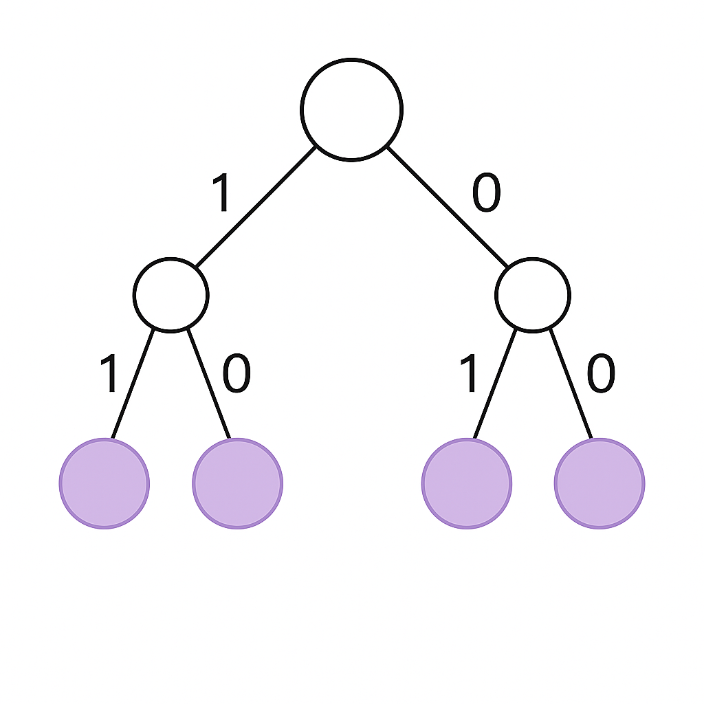

# Deriving Entropy

Conceptually, **entropy** is a measure of how much *surprise* or *randomness* exists across a distribution.
It is closely linked to the fields of **probability** and **combinatorics**.
We will derive entropy from a **binomial distribution**, but first describe its uses and conception.

---

## 🧠 Intuition: Compression and Information

Let's say we have a long novel we are trying to **compress** and send over a network.
Compression means not sending every word literally, but **assigning codes** to each word that are shorter representations.

For example, consider this sentence from our novel:

> "I asked for coffee. I took a sip and realized she added maple syrup in my coffee without asking me."

Instead of sending this sentence directly, we can assign **binary codes** to each word and send the codes, along with a dictionary:

| Word | Binary Code |
|------|--------------|
| I | 0 |
| asked | 1 |
| for | 01 |
| coffee | 11 |

This way, the first part of the sentence can be sent as:

```
0 1 01 11
```

instead of “I asked for coffee.”

---

## ⚙️ The Question Shannon Asked

The question Shannon entropy asks is:
**How do we optimally construct this table?**

The first insight you should have is that the codes `0` and `1` are the most *precious* because they are the shortest possible codes.
They take only **one bit** and hold a lot of information (an entire word).

Shannon’s idea is that the **most frequently used words** should be assigned the **shortest bit sequences** for optimal transmission.


# Understanding Entropy Through Word Frequency

To optimally build the coding table, we would start by constructing a **distribution** of how often each word appears.
For the sake of argument, assume our entire vocabulary comes just from this sentence.
Words like **I** and **coffee** would be the most frequent, so they would get the `0` and `1` codings.

---

### ❓ Question

Let’s say **I**, **sugar**, and **coffee** all have the highest frequencies in this novel and appear about 100 times each.
**Which has the highest entropy?**

A natural tendency might be to say **sugar** and **coffee**, since both have five characters while **I** has only one.
So if we were building a compression protocol, it might seem that assigning `0 = sugar` would save more space than assigning `0 = I`.

This is **incorrect** — they all have **equivalent entropy**, because each word’s appearance is treated as a single **event**, and entropy measures the *surprise* of different events, not their textual length.

---

### 🧠 Conceptual Clarification

Information theory is conceptually linked to compression, but it’s an **ideological abstraction** built around the idea of surprise and uncertainty, not literal text length.
In **coding theory** (which deals with actual compression methods such as *Huffman coding*), the *length of words* or tokens does become relevant.
But in **information theory**, we are concerned only with the **probability distribution of events**.

Imagine discovering another page of this novel.
If the words *I*, *coffee*, and *sugar* all have equally high likelihoods of appearing (perhaps it’s a book about a coffee shop), none of them would be surprising.
But if the word *zebra* suddenly appeared — a word that never occurred in the 200 pages we’ve read — that would be **highly surprising**.
Its **information content** would therefore be higher because it was unexpected.

---

# ⚙️ Formalizing “Surprise”

Entropy is the expectation of surprise over a distribution, not a single event. An expectation of a distribution is just the value of an outcome times the probability of that outcome, summed over all outcomes.

$$
\mathbb{E}[f(X)] = \sum_x p(x)\, f(x)
$$

If you wanted to measure the expectation of rolling a fair six-sided die, the expected value would be:

```math
\frac{1}{6}\cdot 1
+ \frac{1}{6}\cdot 2
+ \frac{1}{6}\cdot 3
+ \frac{1}{6}\cdot 4
+ \frac{1}{6}\cdot 5
+ \frac{1}{6}\cdot 6
```

Conceptually this is equivalent to the average: if a die is rolled an infinite number of times, the average of all rolls will converge to this value.

In entropy, the expectation is over a value known as the **surprise**. Since entropy is an expectation, the formula is:

$$
H = \sum_x p(x)\, \text{surprise}(x)
$$

To define surprise formally, we revisit the question of assigning binary codes. Codes must be collision-free — we must know when one message ends and another begins. If we assign:

- `0 = HHHHHH`  
- `10 = HHHHHT`

and we write `010` into the decoder, it cannot determine whether the stream represents `0,1,0` or `0,10`. Therefore, the prefixes of each code must be unique. Visualizing each distinct outcome as a leaf in a binary tree, only **leaf nodes** may be used as codewords. A non-leaf node is a prefix of deeper nodes and would create ambiguity.
<p align="center">
  <div style="display: inline-flex; gap: 20px; align-items: center;">
    
    <table>
      <tr><th>Code</th><th>Symbol</th></tr>
      <tr><td>00</td><td>A</td></tr>
      <tr><td>01</td><td>B</td></tr>
      <tr><td>10</td><td>C</td></tr>
      <tr><td>11</td><td>D</td></tr>
    </table>
  </div>
</p>


As we construct the binary tree, we reserve more codespace for more frequent events by assigning them leaf nodes that have less depth. In the picture below, we compress a more probable event by giving it the entire left subtree (0.5 codespace), and expand the remaining outcomes by breaking them out as sub-branches of `1`, such as `10` (0.25) and `110` / `111` (0.125 each). The total codespace

$$
0.5 + 0.25 + 0.125 + 0.125
$$

must be **<** to guarantee that the prefix space is non-overlapping. We can choose how many subtrees we make and which codes we assign to them, but the total codespace assigned across all leaves cannot exceed 1.

<p align="center">
  <div style="display: inline-flex; gap: 20px; align-items: center;">
    
    <table>
      <tr><th>Code</th><th>Symbol</th></tr>
      <tr><td>00</td><td>A</td></tr>
      <tr><td>01</td><td>B</td></tr>
      <tr><td>10</td><td>C</td></tr>
      <tr><td>11</td><td>D</td></tr>
    </table>
  </div>
</p>

To illustrate, consider a fair coin with equal probability of H and T. In a binary tree, each flip divides the remaining coding space in half:

$$
\frac{1}{2},\; \frac{1}{4},\; \frac{1}{8},\; \frac{1}{16}, \dots
$$

<image placeholder>

In an unfair coin, say \(P(H)=0.90\), we want to reserve 90% of our coding space for outcomes beginning with H and 10% for those beginning with T. This does not form a perfectly regular tree, so it is easier to visualize it as a continuously subdivided interval.

Before any flip:

```
(0.0, 1.0)
```

After the first flip:

```
H : (0.0, 0.90)
T : (0.90, 1.0)
```

After the first flip, 90% of the available codespace is reserved for H and the remaining 10% for T. The encoder can select any number within the interval corresponding to the observed outcome, and the decoder knows which branch occurred.

Now we subdivide again. If the first flip was H, we subdivide only the H-interval:

```
HH : (0.0, 0.81)
HT : (0.81, 0.90)
```

If the first flip was T, we subdivide only the T-interval:

```
TH : (0.90, 0.99)
TT : (0.99, 1.0)
```

<image placeholder>

If we keep doing this for flips 3, 4, 5, 6, ..., the interval corresponding to the observed sequence becomes narrower and narrower. The **surprise** of an event measures how much the remaining interval contracts when that event occurs.

### **Geometric interpretation of surprise**

If the current coding interval has width \(W_{\text{before}}\) and the event has probability \(p(x)\), then after observing that event the interval shrinks to:

$$
W_{\text{after}} = W_{\text{before}} \cdot p(x)
$$

Surprise is the geometric amount by which the interval width contracts when the symbol is observed.

#
## Formula for Surprise

Surprise links the collapse of the remaining probability mass after seeing a new event X to a unit of information (bits).

Lets say we are rolling a 4 sided die with a 40% chance of 1, 20% chance of 2,3 and 4.
There are 4^n such sequences. Assume we roll the dice 4 times there are:

$$
4^4 = 256
$$

different outcomes.

Example outcomes:
- (1,1,2,4)
- (1,2,2,4)
- (2,1,2,4)

We'll derive the formula for surprise by examining the surprise of rolling a 1 on the first outcome.

Before we roll there are 256 possible outcomes. 40% of probability mass is reserved for outcomes beginning with 1, of which there are:

$$
1 \cdot 4 \cdot 4 \cdot 4 = 64
$$

There are:

$$
3 \cdot 4 \cdot 4 \cdot 4 = 192
$$

outcomes that do not begin with 1.

| Case | Description | Number of Outcomes | Probability Mass |
|----|-------------|-------------------|------------------|
| X = 1 | Outcomes beginning with 1 | 64 | 0.4 |
| X ≠ 1 | Outcomes not beginning with 1 | 192 | 0.6 |

Before any roll: (0, 1.0)

There exist two worlds before our roll: one where event X = 1 occurs and one where X = 1 did not occur.
Notice surprise does not depend on how many other outcomes there are, it depends solely on the probability of the target outcome because conceptually it eliminates the probability mass from observing X, not zooming into the mass of an event not involving X.

If we roll X = 1, it eliminates 60% of the remaining probability mass. So we arrive at the interval:

(0, 0.4)

So the factor by which our probability distribution collapsed was from 1 previously to 0.4. The ratio is:

$$
\frac{1}{0.4} = 2.5
$$

Another way to think about how much probability mass was eliminated is to move from a ratio to bits. Assume for a second we have a much smaller number of possible sequences before our 2nd roll:

- (1,2,1,1)
- (1,4,4,4)
- (1,2,2,2)
- (1,1,1,1)

We roll a 2. So this eliminates half of our initial set of possibilities:

- (1,2,1,1)
- (1,2,2,2)

In bits, it leaves us with 1 bit. Because with 1 binary question (0 or 1, yes or no) we can isolate which sequences belong in our new set.

| Binary Outcome | Sequences |
|---------------|-----------|
| 0 | (1,2,1,1), (1,2,2,2) |
| 1 | (1,4,4,4), (1,1,1,1) |

In our version we have a probability mass reduction of 2.5. Converting this to binary is asking how many "halvings" it took to go from our original distribution 1 to 0.4. In general:

- 1 bit = reduction to 1/2
- 2 bits = reduction to 1/4
- N bits = reduction to 1 / 2^N

So eyeballing it, 2.5 corresponds to a little more than 1 bit. The conversion is done by solving:

$$
2^L = 2.5
$$

$$
L = \log_2(2.5) = 1.32 \text{ bits}
$$

If it was a reduction in half (1 / 0.5 = 2) it would be 1 bit, and it takes a little more than 1 bit because 2.5 > 2.

And in general:

$$
\text{Surprise}(X) = \log_2 \frac{1}{p(X)}
$$

So conceptually surprise represents the amount of shrinkage of our prior probability to our new probability after observing a new event.
The 1 / p is a ratio of our prior (1) to the new event we just saw.

If the event is very unlikely, p is small and it shrinks our distribution by a huge factor, and we call it surprising.

If the event is very likely, p is large and the 1 / p ratio is very small and it shrinks our probability by a small amount.

We take that ratio and apply a logarithm to transform the ratio of shrinkage into the 'number of halvings' our distribution shrunk by after seeing that event P.
The unit becomes bits and 1 bit means we removed half of the uncertainty, 2 bits means 1/4, 3 bits means 1/8, and so on.
Usually we end up somewhere with a fractional bit, which just means conceptually in our example of 1.32 the uncertainty was reduced by one full halving plus a little extra.

---

### Surprise Relation to Code Length

Surprise is the removal of uncertainty based on observing some event X.
Code length similarly measures the removal of uncertainty after observing a sequence of multiple events.

If I observe event X then Y then Z, by what factor did it collapse my initial probability before observing those events?
It can be derived as the sum of surprise of those events via a small proof below:

$$
P(x_1, x_2, \dots, x_n) = \prod_{i=1}^n P(x_i)
$$

Factor P is reduced by:

$$
\frac{1}{\prod_{i=1}^n P(x_i)}
$$

Code length:

$$
\text{Code Length}
= \log_2 \frac{1}{\prod_{i=1}^n P(x_i)}
= \sum_{i=1}^n \log_2 \frac{1}{p(x_i)}
$$

Code length and surprise are mathematically illuminating the idea of longer binary sequences for less frequent outcomes and shorter binary sequences for frequent outcomes.
This is fundamentally the problem of compression.

The only reason we can compress at all is because different events appear at different frequencies across some distribution P.
Exploiting the varying frequencies of individual events we can group them into sequences that are more probable than others and give them shorter code lengths.

Surprise measures uncertainty of a single event; code length measures uncertainty of a sequence of events.

Entropy therefore is just the expectation of surprise across an entire distribution.
It is a code length because it is an expectation: the probability of each event multiplied by the surprise of that event.
It is an expectation of surprise across all events P, i.e. the average code length.

### ⚙️ Deriving Entropy from the Binomial Distribution 

It is also possible to derive the formula for entropy from a multinomial distribution - in this case we are deriving binary entropy (2 outcomes) for simplicity and using a binomial distribution.
This distribution models a process with two possible outcomes (e.g., True/False or Heads/Tails) where one outcome has probability \( p \) and the other \( 1 - p \).

The probability mass function (PMF) is given by:

$$
P(X = k) = {n \choose k} p^k (1-p)^{n-k}
$$


where:

| Symbol | Meaning |
|---------|----------|
| \( n \) | Number of trials |
| \( x \) | Number of “successes” (e.g., heads) |
| \( p \) | Probability of success |
| \( 1 - p \) | Probability of failure |

---

## Counting Outcomes in a Binary Process

If we flip a coin once, there are **2 possible outcomes**:

| Flip # | Possible Outcomes |
|---------|-------------------|
| 1 | H, T |

If we flip it twice, there are **4 outcomes**:

| Flip # | Possible Outcomes |
|---------|-------------------|
| 2 | HH, HT, TH, TT |

If we flip it three times, there are **8 outcomes**:

| Flip # | Possible Outcomes |
|---------|-------------------|
| 3 | HHH, HHT, HTH, THH, HTT, THT, TTH, TTT |

In general, for a stochastic binary process, there are
\[
2^{n}
\]
possible distinct sequences of outcomes after \(n\) flips.

---

### Grouping by Number of Successes

Instead of listing every sequence, we can group outcomes by how many times a specific event occurs—for example, the number of **heads**.

For one flip:

| # of Heads | Sequences |
|-------------|------------|
| 1 | H |
| 0 | T |

For two flips:

| # of Heads | Sequences |
|-------------|------------|
| 2 | HH |
| 1 | HT, TH |
| 0 | TT |

For three flips:

| # of Heads | Sequences |
|-------------|------------|
| 3 | HHH |
| 2 | HHT, HTH, ... THH |
| 1 | TTH, THT, HTT |
| 0 | TTT |

---

### General Case

In general, the number of distinct sequences that contain exactly \(k\) successes (for example, \(k\) heads) in \(n\) flips is given by the **binomial coefficient**:

$$
 {n \choose k} = n!/(n-k)! * r
$$
### Combining Counts with Probabilities

Now that we know how to count the number of ways \(k\) successes can occur in \(n\) flips,
we also need to account for the **probability** of each outcome.

Let:
- \(p\) = probability of a single **success** (e.g., getting a head),
- \(1 - p\) = probability of a single **failure** (e.g., getting a tail),
- \(k\) = number of successes,
- \(n\) = total number of flips.

Because each coin flip is independent, the probability of any specific sequence with
\(k\) heads and \(n - k\) tails is given by:

\[
p^{k} (1 - p)^{\,n - k}.
\]

This follows from the **Multiplication Rule for Independent Events**,
which states that if two (or more) events occur independently,
the probability of all of them happening together is the product of their individual probabilities.

---

### Why This Makes Sense

Each flip contributes one probability factor:
- for every head → multiply by p,
- for every tail → multiply by (1 - p).

So, for example:
- The sequence `HHT` has probability p * p * (1 - p) = p^2 (1 - p).
- The sequence `HTT` has probability p * (1 - p) * (1 - p) = p (1 - p)^2.

Every sequence with k heads and n - k tails has the same probability p^{k}(1 - p)^{n - k}.
When combined with the number of such sequences, binom{n}{k},
this leads to the **binomial distribution**:

$$
P(X = k) = \binom{n}{k} p^{k} (1 - p)^{n - k}
$$


## Derivation of Binary Entropy

Start with the combinatorial term:

$$
{n \choose k} = \frac{n!}{k!(n-k)!}
$$

Take the log:

$$
\log {n \choose k} = \log(n!) - \log(k!) - \log((n-k)!)
$$

Apply Stirling’s approximation log(n!) = nlog n - n:

$$
\log {n \choose k} \approx (n\log n - n) - [k\log k - k] - [(n-k)\log(n-k) - (n-k)]
$$

Simplify:

$$
\log {n \choose k} \approx n\log n - k\log k - (n-k)\log(n-k)
$$

Normalize per trial:

$$
\frac{1}{n}\log {n \choose k} \approx \log n - \frac{k}{n}\log k - \left(1 - \frac{k}{n}\right)\log(n-k)
$$

The next step requires substiting k = np.

# Why We Substitute k = np

When we flip a coin many times, not every sequence has the same number of heads.
Some sequences have fewer, some have more — but most sequences cluster around the **expected number** of heads, which is: k = np. That value represents the most probable outcome of the binomial distribution — it’s where the probability curve peaks.

---

## Understanding the Typical Region

As the number of flips n increases, the probability of getting a result *too far away* from np
(for example, all tails, or 90% heads instead of 70%) becomes astronomically small.

Almost every realistic sequence you could observe will have a number of heads *very close* to np.
So when we calculate entropy — the **average information content** — we only need to describe what happens around that "typical" region, because that’s where almost all the probability mass lives.

| Term | Meaning |
|------|----------|
| $$n$$ | Number of trials (coin flips) |
| $$p$$ | Probability of a single success (e.g., heads) |
| $$k$$ | Number of successes (heads) |
| $$np$$ | Expected number of successes (the mean of the distribution) |

This is why in entropy derivations, we substitute k = np — it represents the center of all the most likely outcomes.

---

## What “ε” (Epsilon) Means

The symbol **ε** ("epsilon") is a small positive number that defines what we mean by *close* to p.

For example, if p = 0.7 and we choose ε = 0.01, we are talking about all sequences where the observed fraction of heads is between **0.69 and 0.71**. That range is called the **ε-typical region**.
and it shrinks to a small region as N increases. Due to the combinatorial explosion of different possibilities most probability mass is reserved for a tiny few selected outcomes. It can also be explained via the multiplication rule: 70% H flip, rolling 1 tail isnt that hard. if N is 10, rolling 8-10 tails is very unlikely. If N = 100, rolling 80-100 tails is exponentially more unlikely and practically impossible. Which ties into info theory because when it does happen the code for that outcome is very long (high bits). More bits, means more surprise, higher entropy, because we dont expect to transmit it at often (or at all, like 1 million tails)

<div style="display: flex; justify-content: space-around; align-items: center;">   </div>


Almost every long sequence will fall inside this region when $$n$$ is large enough.

| Concept | Description |
|----------|--------------|
| ε | Small tolerance that defines what "close to p" means |
| p - ε to p + ε | Range of values for the observed frequency of successes |
| **ε-typical region** | The set of sequences whose observed frequencies lie within that range |


## Putting It All Together

| Idea | Explanation |
|------|--------------|
| **1.** k = np | Marks the center of the typical region — the most probable number of successes |
| **2.** **ε defines width** | Sets how far from p we still consider “typical” |
| **3.** **Law of Large Numbers** | As n grows, almost all outcomes lie within that ε-region |
| **4.** **Entropy’s role** | Measures how many bits we need (on average) to describe the typical region |

So:
- Substituting k = np doesn’t ignore other outcomes — it **anchors** the analysis at the region where almost all probability lies.
- The nearby outcomes within p ± ε are automatically accounted for because, as n → ∞, they behave the same way as the mean case.
- Entropy describes the **information rate** of that typical region — the number of bits required to identify one sequence from the many likely ones.

## Finsih Entropy Derivation (Substitute k = np)

$$
\frac{1}{n}\log {n \choose np} = \log n - p\log(np) - (1-p)\log(n(1-p))
$$

Expand the log terms:

$$
\log(np) = \log n + \log p, \quad \log(n(1-p)) = \log n + \log(1-p)
$$

Substitute back:

$$
\frac{1}{n}\log {n \choose np} = \log n - [p(\log n + \log p) + (1-p)(\log n + \log(1-p))]
$$

Simplify and cancel \(\log n\) terms:

$$
\frac{1}{n}\log {n \choose np} = -p\log p - (1-p)\log(1-p)
$$

Recognize this as the entropy function:

$$
H(p) = -p\log(p) - (1-p)\log(1-p)
$$


### Summary

| Concept | Meaning |
|----------|----------|
| log(1/p) | Converts probability to "surprise" in bits |
| p log(1/p)| Weights surprise by how often the event occurs |
| H = sum ( p log(1/p) )| Expected surprise (entropy) |
| Fair coin | All outcomes equally surprising (3 bits for 3 flips) |
| Biased coin | Common outcomes use fewer bits; rare ones use more |

Entropy is thus the **theoretical limit of compression** —
the smallest average number of bits required to encode the outcomes of a distribution.
